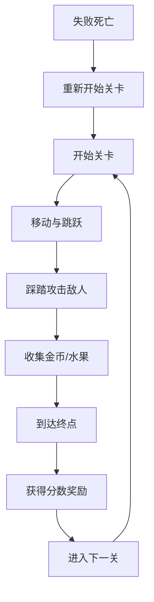

# 游戏设计文档（GDD）
**游戏名**：骑士的奥德赛大冒险
**版本**：1.0
**更新日期**：2025-12-16

---

## 1 版本记录
| 日期 | 版本 | 修订人 | 变更摘要 |
| ---- | ---- | ------ | -------- |
| 2025-12-16 | 1.0 | AI Assistant | 初始版本创建，定义核心玩法和系统架构 |

---

## 2 高阶信息
| 项目 | 内容 |
| ---- | ---- |
| 一句话愿景 | 一款充满挑战的2D像素平台跳跃游戏，通过精准的操作和踩踏攻击击败敌人，收集宝藏，完成冒险。 |
| 品类 | 2D平台跳跃（Platformer） |
| 目标平台 | PC、Mac |
| 核心受众 | 8-35岁，喜欢复古像素风格和平台跳跃游戏的玩家 |
| 竞品对标 | 《超级马里奥》、《蔚蓝》- 像素风格，但更注重二段跳和踩踏攻击的独特手感 |

---

## 3 核心玩法循环图


---

## 4 30 秒体验脚本
| 时间轴 | 画面 & 操作 | 玩家感受 |
| ------ | ----------- | -------- |
| 0-5s   | 像素风格的骑士出现在绿色草原上，背景音乐响起 | 怀旧、轻松 |
| 5-15s  | 使用A/D键移动，空格键跳跃，感受流畅的物理反馈 | 操控简单，手感舒适 |
| 15-30s | 遇到绿色史莱姆，跳起踩踏消灭，收集金币，到达旗帜过关 | 成就感，想要继续探索 |

---

## 5 系统概览表
| 系统名 | 定位 | 入口等级 | 主要奖励 | 备注 |
| ------ | ---- | -------- | -------- | ---- |
| 角色控制 | 核心 | 1 | 基础移动能力 | 状态机架构 |
| 战斗系统 | 核心 | 1 | 分数、过关 | 踩踏攻击机制 |
| 收集系统 | 核心 | 1 | 分数、额外生命 | 金币、水果 |
| 关卡系统 | 内容 | 1 | 过关奖励 | 5个精心设计的关卡 |
| 生命系统 | 生存 | 1 | 游戏机会 | 3条初始生命 |
| 音频系统 | 体验 | 1 | 沉浸感 | BGM和音效 |

---

## 6 单系统模板（复制 N 份）

### 6.1 角色控制系统
1. **设计目的**
   提供流畅、响应迅速的角色控制体验，让玩家能够精确地控制骑士的移动和跳跃。

2. **入口 & 前置**
   UI 路径：游戏主场景
   开放条件：游戏启动时即可使用

3. **规则与流程**
   - 主流程图：
   ```mermaid
   graph LR
       A[按下左/右] --> B[行走状态]
       B --> C[松开按键]
       C --> D[空闲状态]
       D --> E[按下跳跃]
       E --> F[跳跃状态]
       F --> G[到达顶点]
       G --> H[下落状态]
       H --> I[落地]
       I --> D
   ```
   - 分支表：
     | 条件 | 结果 |
     | ---- | ---- |
     | 在空中再次按下跳跃 | 二段跳（后续实现） |
     | 在跳跃中踩到敌人 | 弹跳并获得分数 |
     | 掉出地图 | 失去一条生命，重新开始 |

4. **界面 & 交互**
   - 键盘控制：
     - A键 / 左箭头：向左移动
     - D键 / 右箭头：向右移动
     - 空格键：跳跃
     - ESC键：暂停游戏
   - 手柄控制：
     - 左摇杆：移动
     - A按钮：跳跃
     - Start按钮：暂停

5. **数值 / 奖励**
   | 参数 | 数值 | 说明 |
   | ---- | ---- | ---- |
   | 移动速度 | 150.0 | 水平移动速度 |
   | 加速度 | 300.0 | 从静止到最大速度的时间 |
   | 地面摩擦力 | 1200.0 | 松开按键后的减速效果 |
   | 空气摩擦力 | 1800.0 | 空中控制的精确度 |
   | 跳跃初速度 | -320.0 | 跳跃高度 |

6. **异常处理**
   - 卡住处理：玩家被困在无法移动的位置时，3秒后自动重置到最近的安全点
   - 物理异常：检测到异常速度时自动重置位置

7. **验收标准**
   - 按键响应时间 < 100ms
   - 60FPS稳定运行
   - 无穿模或卡顿现象

### 6.2 战斗系统
1. **设计目的**
   通过踩踏攻击机制提供简单有趣但富有挑战性的战斗体验。

2. **入口 & 前置**
   UI 路径：游戏过程中自然触发
   开放条件：游戏开始

3. **规则与流程**
   - 主流程：
   ```mermaid
   graph LR
       A[敌人出现] --> B[玩家接近]
       B --> C[玩家跳跃]
       C --> D[从上方踩踏]
       D --> E[敌人消灭]
       E --> F[玩家弹跳]
       F --> G[获得分数]
   ```
   - 伤害规则：
     | 行为 | 结果 |
     | ---- | ---- |
     | 从上方踩踏敌人 | 敌人消灭，玩家小幅弹跳 |
     | 水平碰撞敌人 | 玩家失去一条生命 |
     | 踩踏紫色史莱姆 | 敌人需要踩踏2次才消灭 |

4. **界面 & 交互**
   - 视觉反馈：
     - 踩踏成功时播放消灭特效
     - 紫色史莱姆被踩时变色表示受伤
   - 音效反馈：
     - 踩踏成功：播放tap音效
     - 敌人消灭：播放explosion音效

5. **数值 / 奖励**
   | 敌人类型 | 分数 | 特殊能力 |
   | ---- | ---- | ---- |
   | 绿色史莱姆 | 100 | 基础敌人，一踩即死 |
   | 紫色史莱姆 | 200 | 需要踩踏2次 |

6. **异常处理**
   - 敌人卡住：定期检查敌人位置，异常时重置
   - 伤害判定异常：使用多层碰撞检测确保准确性

7. **验收标准**
   - 伤害判定准确率 99.9%
   - 特效播放流畅无延迟
   - 分数计算正确无误

### 6.3 收集系统
1. **设计目的**
   通过收集物增加关卡的探索乐趣，提供额外的挑战和奖励。

2. **入口 & 前置**
   UI 路径：关卡中分布
   开放条件：游戏开始

3. **规则与流程**
   - 收集流程：
   ```mermaid
   graph LR
       A[接触收集物] --> B[播放音效]
       B --> C[增加分数]
       C --> D[物品消失]
       D --> E[特殊效果]
   ```
   - 收集规则：
     | 物品 | 效果 | 分数 |
     | ---- | ---- | ---- |
     | 金币 | +10分 | 10 |
     | 水果 | +50分，每100分加一条命 | 50 |

4. **界面 & 交互**
   - 视觉效果：
     - 金币：旋转动画，收集时闪光消失
     - 水果：轻微上下浮动，收集时星形特效
   - HUD显示：实时显示当前分数和生命值

5. **数值 / 奖励**
   | 收集目标 | 奖励 |
   | ---- | ---- |
   | 100分 | 额外一条生命（最多5条） |
   | 收集所有金币 | 额外500分奖励 |

6. **异常处理**
   - 收集物未响应：使用范围检测补充碰撞检测
   - 分数计算错误：定期校验总分

7. **验收标准**
   - 收集判定响应 < 50ms
   - 特效播放流畅
   - 分数统计准确

### 6.4 关卡系统
1. **设计目的**
   提供5个精心设计的关卡，逐步增加难度，展现不同的游戏机制。

2. **入口 & 前置**
   UI 路径：主菜单→开始游戏
   开放条件：游戏启动

3. **规则与流程**
   - 关卡流程：
   ```mermaid
   graph LR
       A[选择关卡] --> B[进入关卡]
       B --> C[探索与挑战]
       C --> D[到达终点旗帜]
       D --> E[显示结算界面]
       E --> F[解锁下一关]
   ```
   - 进度保存：自动保存已解锁的最高关卡

4. **界面 & 交互**
   - 关卡选择界面：显示已解锁关卡，预览关卡主题
   - 关卡内显示：关卡名称、当前进度

5. **关卡设计概要**
   | 关卡 | 主题 | 长度 | 特色机制 | 推荐难度 |
   | ---- | ---- | ---- | ---- | ---- |
   | 1-1 | 草原 | 短 | 基础教学，简单跳跃 | ★☆☆☆☆ |
   | 1-2 | 森林 | 中 | 引入移动平台 | ★★☆☆☆ |
   | 1-3 | 洞穴 | 中 | 黑暗区域，需要精准跳跃 | ★★★☆☆ |
   | 1-4 | 城堡 | 长 | 复杂敌人配置 | ★★★★☆ |
   | 1-5 | 天空 | 中 | 挑战性平台跳跃 | ★★★★★ |

6. **异常处理**
   - 卡关：提供跳过关卡选项（已解锁3关后）
   - 进度丢失：云存储备份进度

7. **验收标准**
   - 关卡加载时间 < 2秒
   - 难度曲线平滑
   - 无恶性bug

### 6.5 生命系统
1. **设计目的**
   提供合理的挑战度，平衡游戏难度和玩家体验。

2. **入口 & 前置**
   UI 路径：HUD显示
   开放条件：游戏开始

3. **规则与流程**
   - 生命机制：
   ```mermaid
   graph LR
       A[游戏开始] --> B[3条生命]
       B --> C[受到伤害]
       C --> D[生命-1]
       D --> E[生命>0?]
       E -->|是| F[在检查点重生]
       E -->|否| G[游戏结束]
   ```
   - 获得生命：
     - 每100分奖励一条生命
     - 最多同时拥有5条生命

4. **界面 & 交互**
   - HUD显示：心形图标表示剩余生命
   - 失去生命时屏幕闪烁红色
   - 获得生命时播放音效和动画

5. **数值 / 奖励**
   | 初始生命 | 最大生命 | 额外获得条件 |
   | ---- | ---- | ---- |
   | 3 | 5 | 每100分获得1条 |

6. **异常处理**
   - 生命显示错误：每帧同步验证
   - 无限生命bug：服务器端验证

7. **验收标准**
   - 生命计算100%准确
   - 视觉反馈及时
   - 无异常增减

### 6.6 音频系统
1. **设计目的**
   通过背景音乐和音效增强游戏的沉浸感和反馈。

2. **入口 & 前置**
   UI 路径：设置菜单
   开放条件：游戏开始

3. **规则与流程**
   - 音频分类：
     - BGM：循环播放背景音乐
     - SFX：事件触发的音效
   - 音量控制：独立调节BGM和SFX音量

4. **界面 & 交互**
   - 设置界面：
     - BGM音量滑块
     - SFX音量滑块
     - 静音选项
   - 快捷键：M键静音/取消静音

5. **音频资源清单**
   | 类型 | 文件 | 用途 |
   | ---- | ---- | ---- |
   | BGM | time_for_adventure.mp3 | 关卡背景音乐 |
   | SFX | coin.wav | 收集金币 |
   | SFX | jump.wav | 跳跃 |
   | SFX | tap.wav | 踩踏攻击 |
   | SFX | explosion.wav | 敌人消灭 |
   | SFX | hurt.wav | 玩家受伤 |
   | SFX | power_up.wav | 获得生命 |

6. **异常处理**
   - 音频设备缺失：静默处理，显示提示
   - 音频文件损坏：使用默认音效

7. **验收标准**
   - 音频延迟 < 50ms
   - 音量调节流畅
   - 无杂音或爆音

---

## 7 关卡与内容清单

### 7.1 世界地图
| 章节 | 关卡 | 主题 | 预估时长 | 解锁条件 |
| ---- | ---- | ---- | ---- | ---- |
| 第一章 | 1-1 | 草原平原 | 3-5分钟 | 游戏开始 |
| 第一章 | 1-2 | 迷失森林 | 5-8分钟 | 完成1-1 |
| 第一章 | 1-3 | 幽深洞穴 | 5-8分钟 | 完成1-2 |
| 第一章 | 1-4 | 废弃城堡 | 8-10分钟 | 完成1-3 |
| 第一章 | 1-5 | 云端之巅 | 5-8分钟 | 完成1-4 |

### 7.2 单关卡模板

#### 1-1 草原平原
| 字段 | 内容 |
| ---- | ---- |
| 关卡 ID | LVL_1_1 |
| 主题 | 绿色草原，适合教学的初始关卡 |
| 时长 | 3-5分钟 |
| 敌人列表 | 5个绿色史莱姆 |
| 掉落表 | 10个金币，2个水果 |
| 事件脚本 | 1. 基础移动教学 2. 跳跃教学 3. 踩踏教学 4. 收集教学 |

#### 1-2 迷失森林
| 字段 | 内容 |
| ---- | ---- |
| 关卡 ID | LVL_1_2 |
| 主题 | 森林环境，引入移动平台 |
| 时长 | 5-8分钟 |
| 敌人列表 | 8个绿色史莱姆，3个紫色史莱姆 |
| 掉落表 | 20个金币，4个水果 |
| 事件脚本 | 1. 移动平台机制 2. 精准跳跃挑战 3. 多敌人战斗 |

#### 1-3 幽深洞穴
| 字段 | 内容 |
| ---- | ---- |
| 关卡 ID | LVL_1_3 |
| 主题 | 黑暗洞穴，需要精准跳跃 |
| 时长 | 5-8分钟 |
| 敌人列表 | 6个绿色史莱姆，5个紫色史莱姆 |
| 掉落表 | 25个金币，3个水果 |
| 事件脚本 | 1. 有限视野机制 2. 连续跳跃挑战 3. 陷阱躲避 |

#### 1-4 废弃城堡
| 字段 | 内容 |
| ---- | ---- |
| 关卡 ID | LVL_1_4 |
| 主题 | 城堡内部，复杂战斗 |
| 时长 | 8-10分钟 |
| 敌人列表 | 10个绿色史莱姆，8个紫色史莱姆 |
| 掉落表 | 30个金币，5个水果 |
| 事件脚本 | 1. 复杂敌人配置 2. Boss战准备 3. 多路径探索 |

#### 1-5 云端之巅
| 字段 | 内容 |
| ---- | ---- |
| 关卡 ID | LVL_1_5 |
| 主题 | 天空平台，终极挑战 |
| 时长 | 5-8分钟 |
| 敌人列表 | 5个紫色史莱姆（精英） |
| 掉落表 | 50个金币，10个水果 |
| 事件脚本 | 1. 极限跳跃挑战 2. 精英敌人战 3. 完美通关奖励 |

---

## 8 角色 & 敌人
| ID | 名称 | 阵营 | 体型 | 关键技能 | 出现关卡 |
| -- | ---- | ---- | ---- | -------- | -------- |
| P1 | 骑士主角 | 玩家 | 32x32像素 | 跳跃、二段跳、踩踏攻击 | 全关卡 |
| E1 | 绿色史莱姆 | 敌人 | 24x24像素 | 基础移动 | 1-1至1-5 |
| E2 | 紫色史莱姆 | 敌人 | 28x28像素 | 快速移动、需要踩2次 | 1-2至1-5 |
| E3 | 精英史莱姆 | 敌人 | 32x32像素 | 跳跃、高速移动 | 1-5 |

---

## 9 故事与叙事
- **世界观概述**：在一个被神秘力量腐化的像素世界中，勇敢的骑士踏上了寻找解药、拯救王国的冒险之旅。五个不同的区域都居住着被腐化的生物，只有通过骑士的勇气和智慧才能净化这片土地。

- **主线大纲**：
  1. **起**：骑士离开家园，进入被腐化的草原
  2. **承**：穿越森林、洞穴和城堡，收集线索，了解腐化真相
  3. **转**：发现腐化的源头在天空之巅，准备最终决战
  4. **合**：击败最终BOSS，净化土地，拯救王国

- **过场动画脚本**：每个关卡开始前有5秒的过场动画展示关卡特色，使用像素风格动画，无配音，只有文字提示。

---

## 10 美术风格
- **关键词**：复古像素风格、8位色彩、简洁明快、童话感
- **参考图链接**：参考经典的FC/NES时代游戏美学
- **资源规格表**
  | 类型 | 分辨率 | 格式 | 备注 |
  | ---- | ---- | ---- | ---- |
  | 角色 | 32x32 | PNG | 帧动画，每方向4帧 |
  | 敌人 | 24-32x24-32 | PNG | 2-4帧动画 |
  | 瓦片 | 32x32 | PNG | TileMap格式 |
  | UI元素 | 1x | SVG | 矢量图，支持缩放 |
  | 特效 | 64x64 | PNG | 帧动画，带透明通道 |

---

## 11 音频需求
- **音乐风格**：8位芯片音乐（Chiptune），BPM 120-140，循环播放
- **音效数量**：UI 5个 / 战斗 10个 / 环境 5个 / 总计 20个
- **音频格式**：音乐使用MP3（128kbps），音效使用WAV（44.1kHz, 16-bit）

---

## 12 技术约束
- **引擎版本**：Godot 4.5
- **运行环境**：
  - PC：Windows 10/11, macOS 10.15+
  - 最低配置：2GB RAM, 集成显卡
  - 目标：60 FPS，内存峰值 ≤500MB
- **网络**：单机游戏，无需网络连接
- **包体大小**：≤100MB（包含所有资源）

---

## 13 数据与埋点
- **经济模型图**：
  ```
  玩家时间 → 收集金币/水果 → 获得分数 → 额外生命 → 更高挑战 → 更多分数
  ```
- **关键事件表**
  | 事件ID | 触发时机 | 字段 | 采样率 |
  | ------- | -------- | ---- | ------ |
  | level_start | 开始关卡 | level_id, timestamp | 100% |
  | level_complete | 完成关卡 | level_id, time, score | 100% |
  | player_death | 玩家死亡 | level_id, death_count | 100% |
  | enemy_kill | 击败敌人 | enemy_type, timestamp | 100% |
  | collect_item | 收集物品 | item_type, position | 50% |

---

## 14 风险 & 假设
| 风险描述 | 概率 | 影响 | 缓解方案 | Owner |
| -------- | ---- | ---- | -------- | ----- |
| 关卡难度曲线不平滑 | 中 | 高 | 大量测试，调整数值 | 关卡设计师 |
| 手柄适配问题 | 低 | 中 | 早期测试多种手柄 | 程序员 |
| 性能优化不足 | 中 | 高 | 定期性能测试，优化渲染 | 程序员 |
| 音频资源版权问题 | 低 | 高 | 使用原创或免费资源 | 音频设计师 |

---

## 15 附录
- **术语表**：
  - GDD：Game Design Document（游戏设计文档）
  - TileMap：瓦片地图，2D游戏常用的关卡构建方式
  - State Machine：状态机，管理角色行为的设计模式

- **缩略语**：
  - FPS：Frames Per Second（每秒帧数）
  - BGM：Background Music（背景音乐）
  - SFX：Sound Effects（音效）
  - HUD：Heads-Up Display（抬头显示）

- **参考文档链接**：
  - Godot 4.5 官方文档
  - 平台跳跃游戏设计指南
  - 像素美术资源制作规范