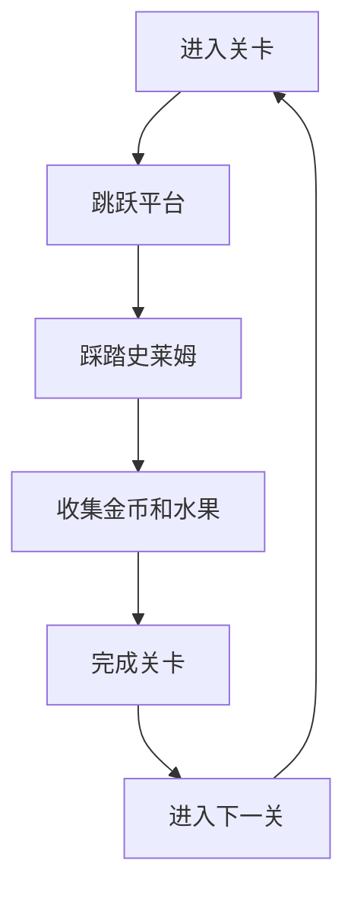

# 游戏设计文档（GDD）
**游戏名**：骑士的奥德赛大冒险
**版本**：v1.1
**更新日期**：2025-12-13

---

## 1 版本记录
| 日期 | 版本 | 修订人 | 变更摘要 |
| ---- | ---- | ------ | -------- |
| 2025-12-13 | v1.0 | Claude | 初始版本创建 |
| 2025-12-13 | v1.1 | Claude | 根据现有资源简化游戏设计，调整为基于已有资源的可实现版本 |

---

## 2 高阶信息
| 项目 | 内容 |
| ---- | ---- |
| 一句话愿景 | 经典的像素艺术平台跳跃冒险 |
| 品类 | 2D像素平台跳跃游戏（Pixel Platformer） |
| 目标平台 | PC / Mac |
| 核心受众 | 8-35岁，喜欢复古像素游戏的玩家 |
| 竞品对标 | 《超级马里奥兄弟》、《铲子骑士》等像素风格平台游戏 |

---

## 3 核心玩法循环图

---

## 4 30秒体验脚本
| 时间轴 | 画面 & 操作 | 玩家感受 |
| ------ | ----------- | -------- |
| 0-5s   | 游戏开场动画，骑士站在城堡门口，背景音乐渐起 | 史诗感开场 |
| 5-15s  | 玩家控制骑士进入第一个平台，教程提示跳跃键（空格） | 简单易上手 |
| 15-30s | 遭遇第一个敌人，展示剑击（Z键）和盾防（X键） | 动作流畅，打击感强 |

---

## 5 系统概览表
| 系统名 | 定位 | 入口等级 | 主要奖励 | 备注 |
| ------ | ---- | -------- | -------- | ---- |
| 基础动作 | 核心 | 1 | - | 移动、跳跃、攻击 |
| 战斗系统 | 核心 | 1 | 金币 | 剑击、火焰术 |
| 关卡系统 | 进程 | 1 | 解锁新关卡 | 1章节，5关 |
| 收集系统 | 探索 | 1 | 金币、分数 | 金币、水果收集 |

---

## 6 游戏系统设计

### 6.1 基础动作系统
1. **设计目的**
   提供流畅的像素风格平台跳跃体验
2. **操作方式**
   - 移动：A/D键左右移动
   - 跳跃：空格键（支持二段跳）
   - 踩踏攻击：从空中落到敌人头顶
   - 暂停：ESC键
3. **物理特性**
   - 重力加速度：适合平台跳跃的物理反馈
   - 跳跃高度：约3个角色高度
   - 移动速度：适中，便于精确控制
   - 踩踏后自动小跳：高度约为正常跳跃的一半
4. **音效反馈**
   - 跳跃：jump.wav
   - 落地：轻柔落地声
   - 踩踏命中：hurt.wav

### 6.2 战斗系统
1. **设计目的**
   经典的平台跳跃战斗机制，简单有趣
2. **战斗方式**
   - 踩踏攻击：从空中跳到敌人头顶，直接击败敌人
   - 踩踏后小跳：踩到敌人后会自动小跳，便于连续踩踏多个敌人
3. **敌人交互**
   - 碰到敌人身体会受伤（除顶部外）
   - 从高处踩到敌人头顶可立即击败
   - 绿色史莱姆：踩踏即击败，移动缓慢
   - 紫色史莱姆：踩踏即击败，移动稍快
4. **界面显示**
   - 左上角：生命值（3颗心）
   - 右上角：金币数量
   - 得分提示：击败敌人时显示
5. **音效**
   - 踩踏命中：hurt.wav
   - 敌人被击败：explosion.wav
   - 收集金币：coin.wav
   - 玩家受伤：hurt.wav

### 6.3 关卡系统
1. **设计目的**
   使用现有瓦片资源创建多样化的关卡
2. **关卡结构**
   - 总计5关，逐步增加难度
   - 使用world_tileset.png和platforms.png构建
   - 每关包含平台、间隙、敌人
3. **关卡特色**
   - 关卡1-2：基础教学，少量敌人
   - 关卡3-4：增加平台复杂度和敌人数量
   - 关卡5：综合挑战，大量史莱姆
4. **进度保存**
   - 完成关卡自动保存
   - 可以选择已解锁的关卡重玩

### 6.4 收集系统
1. **设计目的**
   增加游戏可玩性和探索动机
2. **收集要素**
   - 金币（coin.png）：基础收集物，+10分
   - 水果（fruit.png）：稀有收集物，+50分
3. **计分系统**
   - 收集金币和水果获得分数
   - 完成关卡有时间奖励
   - 击败敌人获得分数
4. **音效反馈**
   - 收集金币：coin.wav
   - 收集水果：power_up.wav

---

## 7 关卡设计

### 7.1 关卡概览
| 关卡 | 主题 | 预估时长 | 敌人数量 | 金币数量 | 水果数量 |
| ---- | ---- | -------- | -------- | -------- | -------- |
| 1-1 | 草原入门 | 3-5分钟 | 3 | 10 | 0 |
| 1-2 | 平台跳跃 | 5-7分钟 | 5 | 15 | 1 |
| 1-3 | 史莱姆群 | 7-10分钟 | 10 | 20 | 2 |
| 1-4 | 高空挑战 | 10-12分钟 | 15 | 25 | 3 |
| 1-5 | 终极测试 | 15-20分钟 | 20 | 30 | 5 |

### 7.2 关卡设计要素
- **场景构建**：使用world_tileset.png作为基础地形，platforms.png作为可跳跃平台
- **关卡特色**：
  - 关卡1-1：直线型关卡，基础教学
  - 关卡1-2：引入平台间隙和跳跃挑战
  - 关卡1-3：增加敌人密度，需要战斗策略
  - 关卡1-4：垂直关卡，需要精确的跳跃时机
  - 关卡1-5：综合所有元素，最终挑战
- **收集物分布**：
  - 金币沿路径放置，引导玩家前进
  - 水果放置在隐藏或难以到达的位置
- **敌人配置**：
  - 绿色史莱姆：主要分布在地面和平台
  - 紫色史莱姆：出现在关键位置和挑战区域

---

## 8 角色 & 敌人

### 8.1 角色系统
| ID | 名称 | 阵营 | 体型 | 资源文件 | 关键能力 |
| -- | ---- | ---- | ---- | -------- | -------- |
| P1 | 骑士 | 主角 | 中型 | knight.png | 移动、跳跃、剑击、火焰术 |

**角色特性**：
- 生命值：3颗心
- 移动速度：适中
- 跳跃高度：3个角色高度
- 攻击方式：剑击（近战）、火焰术（远程）

### 8.2 敌人系统
| ID | 名称 | 阵营 | 体型 | 资源文件 | 生命值 | 特殊行为 |
| -- | ---- | ---- | ---- | -------- | ------ | -------- |
| E01 | 绿色史莱姆 | 敌人 | 小型 | slime_green.png | 1HP | 缓慢移动 |
| E02 | 紫色史莱姆 | 敌人 | 小型 | slime_purple.png | 2HP | 移动稍快 |

**敌人行为**：
- 绿色史莱姆：直线移动，碰到障碍物转向，移动速度慢
- 紫色史莱姆：会追踪玩家，移动速度较快，需要更多次攻击
- 所有史莱姆被击败后掉落1-3枚金币

---

## 9 故事背景

- **世界观概述**：
  在一个和平的像素世界里，年轻的骑士决定踏上一场收集金币和挑战自我的冒险之旅。草原上散落着各种宝藏，但也栖息着调皮的史莱姆。

- **游戏故事**：
  骑士为了证明自己的勇气，开始在草原上冒险。通过跳跃平台、击败史莱姆、收集金币和水果，骑士不断提升自己的技能。这只是一场简单而快乐的冒险，没有复杂的阴谋，只有纯粹的挑战和成长。

- **游戏目标**：
  - 完成5个关卡的挑战
  - 收集所有的金币和水果
  - 获得尽可能高的分数
  - 享受平台跳跃的乐趣

---

## 10 美术风格

- **关键词**：8位像素艺术、复古平台游戏、简洁清晰、色彩明亮
- **视觉特点**：
  - 所有游戏元素采用像素艺术风格
  - 角色和场景使用有限的调色板
  - 动画帧数适中，确保流畅性
  - 界面设计简洁明了

- **现有资源规格表**
  | 类型 | 文件名 | 尺寸 | 用途 |
  | ---- | ------ | ---- | ---- |
  | 主角 | knight.png | 256x256 | 玩家角色精灵 |
  | 场景 | world_tileset.png | 256x256 | 场景瓦片集 |
  | 平台 | platforms.png | 64x64 | 可跳跃平台 |
  | 收集品 | coin.png | 192x16 | 金币精灵序列 |
  | 收集品 | fruit.png | 64x64 | 水果精灵 |
  | 敌人 | slime_green.png | 96x72 | 绿色史莱姆 |
  | 敌人 | slime_purple.png | 96x72 | 紫色史莱姆 |

- **字体资源**
  - PixelOperator8.ttf：主要UI字体
  - PixelOperator8-Bold.ttf：强调文字
  - zpix.ttf：标题或特殊文本

---

## 11 音频需求

- **音乐风格**：轻快的冒险风格音乐，适合平台跳跃游戏
- **现有音频资源**：

### 背景音乐
| 文件名 | 时长 | 用途 |
| ------ | ---- | ---- |
| time_for_adventure.mp3 | ~3分钟 | 游戏主背景音乐，循环播放 |

### 音效
| 文件名 | 用途 | 触发时机 |
| ------ | ---- | -------- |
| jump.wav | 跳跃音效 | 玩家跳跃时 |
| coin.wav | 金币收集 | 收集金币时 |
| hurt.wav | 受伤音效 | 玩家或敌人受伤时 |
| explosion.wav | 爆炸音效 | 敌人被击败时 |
| power_up.wav | 强化音效 | 收集水果或获得道具时 |
| tap.wav | UI点击 | 菜单交互时 |

- **音频格式**：WAV（音效）、MP3（音乐）
- **音量平衡**：音效比音乐稍响，确保可听清

---

## 12 技术约束

- **引擎版本**：Godot 4.5
- **运行环境**：
  - 最低：Windows 10 / macOS 10.15，Intel i5，8GB RAM
  - 目标：60 FPS，内存峰值 ≤1GB
- **网络**：单机游戏，无需联网
- **包体大小**：≤500MB
- **支持分辨率**：1920x1080、1280x720、2560x1440
- **音频格式**：OGG（音乐）、WAV（音效）

---

## 13 操作方案

### 13.1 键盘操作
| 功能 | 按键 | 说明 |
| ---- | ---- | ---- |
| 向左移动 | A | 角色向左移动 |
| 向右移动 | D | 角色向右移动 |
| 跳跃 | 空格 | 支持二段跳 |
| 踩踏攻击 | 自动 | 从空中落到敌人头顶即可 |
| 暂停 | ESC | 打开暂停菜单 |

**操作说明**：
- 移动和跳跃可以同时进行
- 跳跃时可以调整方向
- 踩到敌人头顶会自动小跳，可连续踩踏多个敌人
- 碰到敌人身体侧面会受伤
- 空中可以转向，便于调整落点

---

## 14 游戏进度保存

- **保存内容**：
  - 当前解锁的关卡
  - 每关的最高分数
  - 总金币收集数

- **保存时机**：
  - 完成关卡时自动保存
  - 收集新物品时更新

- **存档位置**：
  - 用户本地目录
  - JSON格式存储

---

## 15 风险 & 限制

| 风险/限制 | 描述 | 影响 | 应对方案 |
| --------- | ---- | ---- | -------- |
| 资源数量有限 | 只有基本的像素艺术资源 | 游戏内容相对简单 | 充分利用现有资源，通过关卡设计增加可玩性 |
| 音效较少 | 只有6个基础音效 | 音频反馈可能单调 | 合理使用音效，避免过度重复 |
| 无手柄支持 | 只支持键盘操作 | 用户体验受限 | 键盘操作优化，确保手感良好 |
| 内容简单 | 缺乏复杂游戏机制 | 游戏时长较短 | 专注于核心玩法的打磨，提高重玩价值 |

---

## 16 附录

### 术语表
- **GDD**：游戏设计文档（Game Design Document）
- **像素艺术**：使用像素作为基本单位的数字艺术风格
- **平台跳跃游戏**：以跳跃和平台移动为核心机制的游戏类型

### 缩略语
- **HP**：生命值（Health Points）
- **UI**：用户界面（User Interface）

### 参考资源
- 游戏资源：assets/ 目录下的所有文件
- Godot 4.5文档：https://docs.godotengine.org/