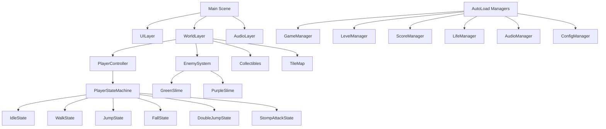
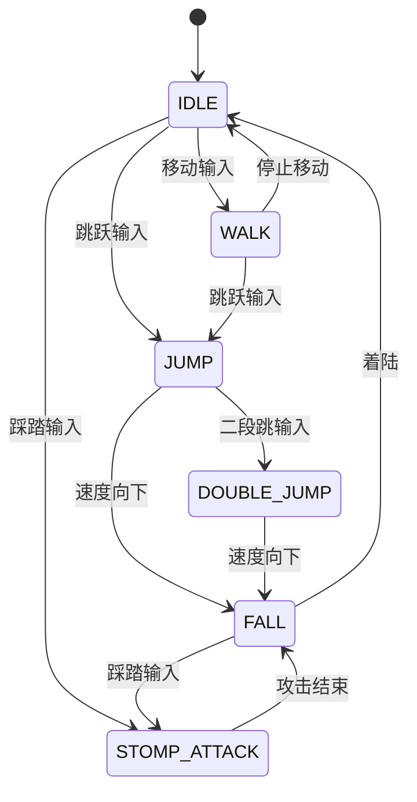

## 0 封面
| 项目 | 内容 |
| ---- | ---- |
| 游戏名称 | 骑士的奥德赛大冒险 |
| 文档编号 | ARCH-2024-001 |
| 版本 | 1.0 |
| 作者 / 主程 | Claude Code |
| 评审人 | 待定 |
| 最后更新 | 2024-12-16 |

---

## 1 版本记录
| 日期 | 版本 | 修订人 | 变更摘要 |
| ---- | ---- | ------ | -------- |
| 2024-12-16 | 1.0 | Claude Code | 初始版本创建，定义整体架构设计 |

---

## 2 目标与范围
- **目标**：定义《骑士的奥德赛大冒险》游戏的总体技术架构，指导开发团队实现一个高性能、可维护的2D平台跳跃游戏。
- **范围**：覆盖【客户端架构设计】，不包括【服务器架构（单机游戏）】。

---

## 3 总体架构蓝图
### 3.1 架构原则
1. 基于Godot 4.5场景树架构，保持引擎原生特性。
2. 状态机驱动角色行为，事件驱动实现松耦合。
3. 模块化组件设计，支持功能复用和扩展。
4. 目标60FPS，内存峰值≤500MB，支持PC/Mac平台。

### 3.2 顶层模块图


---

## 4 客户端架构
### 4.1 分层与目录规范
```
knight-odyssey/
├─ assets/
│  ├─ fonts/          # 字体资源
│  ├─ music/          # 背景音乐
│  ├─ sounds/         # 音效文件
│  └─ sprites/        # 精灵图片
├─ configs/           # 配置文件
│  └─ player_config.cfg
├─ scenes/
│  ├─ characters/     # 角色场景
│  ├─ levels/         # 关卡场景
│  └─ ui/             # UI场景
├─ scripts/
│  ├─ core/           # 核心系统
│  │  ├─ managers/    # 管理器脚本
│  │  └── EventBus.gd # 事件总线
│  ├─ characters/
│  │  ├─ states/      # 玩家状态
│  │  └── components/ # 角色组件
│  ├─ enemies/        # 敌人脚本
│  ├─ levels/         # 关卡脚本
│  └─ ui/             # UI脚本
└─ docs/              # 项目文档
```

### 4.2 框架选型
- 游戏引擎：Godot 4.5
- 脚本语言：GDScript
- 资源管理：Godot Resource System + ConfigFile
- 状态管理：状态机模式 + Godot信号系统
- 包体：首包 ≤200 MB，资源按需加载。

### 4.3 关键时序
| 场景 | 时序图 |
| ---- | ------ |
| 游戏启动 | MainScene→AutoLoad加载→场景初始化→配置加载 |
| 状态切换 | InputEvent→PlayerController→StateMachine→StateExit→StateEnter |
| 敌人交互 | 碰撞检测→Damage→HealthComponent→LifeManager→UI更新 |

---

## 5 核心系统设计
### 5.1 玩家控制系统
**状态机架构：**
- PlayerController (CharacterBody2D)：根节点，统一输入处理
- PlayerStateMachine：状态管理器，负责状态转换
- PlayerState基类：定义状态接口（enter/exit/update/handle_input）
- 具体状态类：IdleState, WalkState, JumpState, FallState, DoubleJumpState, StompAttackState

**状态转换流程：**


### 5.2 敌人系统
**架构设计：**
- EnemyController基类：通用敌人行为
- 子类化实现：GreenSlime, PurpleSlime
- HealthComponent：生命值管理
- 状态机管理：PATROL, CHASE, STUNNED, DYING

### 5.3 游戏管理系统（AutoLoad单例）
| 管理器 | 职责 | 数据持久化 |
| ------ | ---- | ---------- |
| GameManager | 总控制器，协调各系统 | 否 |
| LevelManager | 关卡管理，进度保存 | ConfigFile |
| ScoreManager | 分数统计，生命奖励 | 否 |
| LifeManager | 生命值管理，游戏状态 | 否 |
| AudioManager | 音频播放，音效管理 | 否 |
| ConfigManager | 配置加载，参数管理 | ConfigFile |

---

## 6 场景架构设计
### 6.1 主场景分层架构
```
Main Scene
├─ UILayer (CanvasLayer)
│  ├─ HUD
│  ├─ PauseMenu
│  └─ GameOverMenu
├─ WorldLayer
│  ├─ TileMap
│  ├─ Player
│  ├─ Enemies
│  ├─ Collectibles
│  └─ Checkpoints
└─ AudioLayer
   ├─ BGMPlayer
   └─ SFXPlayers
```

### 6.2 关卡场景结构
- TileMap：使用world_tileset.png和platforms.png
- SpawnPoints：玩家和敌人生成点
- Collectibles：金币和水果收集物
- Checkpoints：检查点系统
- Triggers：区域触发器（切换场景、剧情等）

---

## 7 数据与存储
### 7.1 配置文件系统
```ini
[player]
move_speed=150.0
acceleration=300.0
floor_friction=1200.0
air_friction=1800.0
jump_velocity=-320.0
is_debug=false

[game]
default_lives=3
score_per_coin=100
score_per_fruit=500
```

### 7.2 存档系统
- 位置：user://save/
- 格式：Godot ConfigFile
- 内容：关卡进度、最高分数、收集状态、配置选项

---

## 8 事件系统设计
### 8.1 EventBus单例架构
```gdscript
# 全局事件定义
signal player_state_changed(old_state, new_state)
signal player_damaged(damage)
signal enemy_died(enemy)
signal coin_collected(value)
signal fruit_collected(type)
signal checkpoint_reached(checkpoint_id)
signal level_completed(level_name)
signal game_over()
```

### 8.2 事件流程
1. 发送方：使用EventBus.emit_signal发送事件
2. 接收方：通过EventBus.connect订阅感兴趣的事件
3. 解耦：发送方和接收方无需直接引用

---

## 9 性能优化策略
### 9.1 渲染优化
- 使用TileMap批处理渲染
- 精灵图集（SpriteAtlas）减少Draw Call
- 视锥剔除（Viewport Culling）

### 9.2 内存管理
- 资源按需加载（Resource.preload）
- 场景切换时释放未使用资源
- 对象池管理频繁创建的敌人

### 9.3 性能监控指标
| 指标 | 目标值 | 监控方式 |
| ---- | ------ | -------- |
| 帧率 | 60 FPS | Godot Debugger |
| 内存峰值 | ≤500MB | Godot Profiler |
| 加载时间 | ≤3秒 | 自定义计时器 |
| 状态切换 | <16ms | 代码埋点 |

---

## 10 安全与兼容性
### 10.1 数据安全
- 存档文件使用简单加密
- 配置文件只读保护
- 防调试代码保护

### 10.2 平台兼容性
- PC：Windows 10+, macOS 10.15+
- 分辨率适配：1280x720~1920x1080
- 输入设备：键盘（WASD/箭头），可选手柄支持

---

## 11 风险与假设
| 风险 | 概率 | 影响 | 缓解方案 | Owner |
| ---- | ---- | ---- | -------- | ----- |
| Godot版本兼容性 | 低 | 中 | 锁定Godot 4.5版本 | 技术组 |
| 性能不达标 | 中 | 高 | 性能优化预研，原型验证 | 开发组 |
| 状态机复杂度 | 中 | 中 | 完善文档，单元测试 | 主程 |

---

## 12 里程碑 & 责任矩阵
| 里程碑 | 日期 | 交付物 | 负责人 |
| ------ | ---- | ------ | ------ |
| 架构评审 | 2024-12-20 | 本文档 + 原型演示 | 主程 |
| 核心系统实现 | 2025-01-15 | 状态机 + 基础移动 | 开发组 |
| 第一关卡完成 | 2025-02-15 | 完整游戏循环 | 全部 |
| 性能优化 | 2025-03-01 | 60FPS稳定运行 | 技术组 |

---

## 13 附录
### A. 术语表
- **State Machine**：状态机，用于管理角色行为的模式
- **AutoLoad**：Godot的单例机制，全局可访问的管理器
- **CharacterBody2D**：Godot的2D角色物理节点
- **TileMap**：瓦片地图，用于构建2D关卡

### B. 缩略语
- FPS：Frames Per Second，每秒帧数
- UI：User Interface，用户界面
- HUD：Heads-Up Display，平视显示器

### C. 参考文档
- Godot 4.5官方文档：https://docs.godotengine.org/
- 游戏状态机模式：https://gameprogrammingpatterns.com/state.html
- Godot最佳实践：https://docs.godotengine.org/en/stable/tutorials/best_practices/index.html