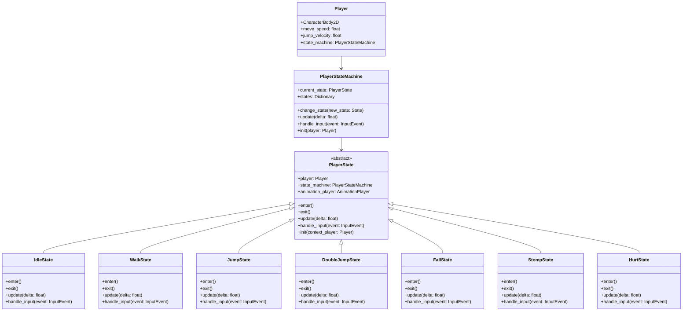

# 骑士的奥德赛大冒险 - 游戏架构概要设计

## 1. 引言

### 1.1 文档目的
本文档旨在详细描述《骑士的奥德赛大冒险》的整体架构设计，为开发团队提供技术实现指南，确保项目按照统一的技术规范进行开发。

### 1.2 项目背景
《骑士的奥德赛大冒险》是一款2D像素风格的平台跳跃游戏，玩家扮演骑士角色，通过跳跃和踩踏攻击等方式击败敌人，收集金币和水果，完成5个渐进难度的关卡。

### 1.3 术语定义
- **AutoLoad**：Godot引擎中的单例实现方式，在项目启动时自动加载并全局可访问
- **TileMap**：Godot中用于构建关卡地形的瓦片地图系统
- **CharacterBody2D**：Godot中用于2D角色物理控制的节点类型
- **Area2D**：Godot中用于区域检测的节点类型
- **状态机**：一种行为设计模式，允许对象在内部状态改变时改变它的行为

## 2. 系统概述

### 2.1 游戏基本信息
- **游戏名称**：骑士的奥德赛大冒险
- **游戏类型**：2D像素平台跳跃游戏
- **开发引擎**：Godot 4.5
- **目标平台**：PC/Mac（单机游戏）
- **编程语言**：GDScript

### 2.2 核心功能模块
1. **基础动作系统**：角色移动、跳跃（支持二段跳）、踩踏攻击、游戏暂停
2. **战斗系统**：踩踏击败敌人机制、生命值系统、敌人击败后金币掉落
3. **关卡系统**：5个渐进难度关卡、基于TileMap的地形构建
4. **收集系统**：金币收集（+10分）、水果收集（+50分）、实时计分系统
5. **音效系统**：背景音乐循环播放、动作音效、UI音效

### 2.3 技术约束
- **性能要求**：稳定运行在60 FPS
- **内存限制**：峰值内存使用不超过1GB
- **包体大小**：最终发布包体不超过500MB
- **美术资源**：使用提供的像素艺术资源包

## 3. 系统架构

### 3.1 架构原则

#### 3.1.1 模块化设计
- 将游戏功能划分为独立的模块，每个模块负责特定的功能领域
- 模块间通过明确定义的接口进行通信
- 降低模块间的耦合度，提高代码的可维护性

#### 3.1.2 高性能优先
- 优化渲染管线，确保60 FPS稳定运行
- 合理使用对象池减少内存分配和垃圾回收
- 采用空间分区优化碰撞检测性能

#### 3.1.3 可扩展性
- 预留扩展接口，便于添加新关卡、敌人和游戏功能
- 使用配置文件管理游戏参数，便于调整和平衡
- 支持模组化的关卡编辑功能

#### 3.1.4 代码复用
- 通过继承机制复用通用功能
- 使用组合模式构建复杂对象
- 建立公共组件库，减少重复代码

### 3.2 场景树架构

游戏采用分层场景树结构，确保清晰的层级关系和高效的管理：

```
Game (Node2D)
├── GameManager (Node) - AutoLoad单例
├── UIManager (CanvasLayer) - AutoLoad单例
├── AudioManager (Node) - AutoLoad单例
└── World (Node2D)
    ├── Level (Node2D)
    │   ├── TileMap (TileMap) - 关卡地形
    │   ├── SpawnPoints (Node2D) - 生成点
    │   └── Collectibles (Node2D) - 收集物
    ├── Player (CharacterBody2D)
    ├── Enemies (Node2D)
    └── Camera (Camera2D)
```

### 3.3 核心系统设计

#### 3.3.1 GameManager（全局游戏管理）
- **类型**：AutoLoad单例
- **核心职责**：
  - 游戏状态机管理（主菜单、游戏中、暂停、游戏结束、关卡完成）
  - 全局数据管理（分数、生命值、金币数量）
  - 关卡进度控制和切换
  - 游戏存档和读档管理

#### 3.3.2 PlayerSystem（玩家控制系统）- **状态机实现**

##### 3.3.2.1 玩家状态机架构
玩家系统采用状态机模式实现，将玩家的各种行为分解为独立的状态。

##### 3.3.2.2 核心类关系



##### 3.3.2.3 状态转换流程


##### 3.3.2.4 状态职责说明

**1. 空闲状态（IdleState）**
- **职责**：处理站立状态
- **触发条件**：角色静止且在地面上
- **转换条件**：
  - 移动键按下 → WalkState
  - 跳跃键按下 → JumpState
  - 受到伤害 → HurtState

**2. 行走状态（WalkState）**
- **职责**：处理水平移动
- **触发条件**：角色在地面上且有水平输入
- **转换条件**：
  - 停止移动 → IdleState
  - 跳跃键按下 → JumpState
  - 受到伤害 → HurtState

**3. 跳跃状态（JumpState）**
- **职责**：处理第一次跳跃
- **触发条件**：在地面上按下跳跃键
- **转换条件**：
  - 速度向下 → FallState
  - 二段跳输入 → DoubleJumpState
  - 受到伤害 → HurtState

**4. 二段跳状态（DoubleJumpState）**
- **职责**：处理第二次跳跃
- **触发条件**：在下落状态下按下跳跃键且二段跳可用
- **转换条件**：
  - 速度向下 → FallState
  - 受到伤害 → HurtState

**5. 下落状态（FallState）**
- **职责**：处理下落和空中移动
- **触发条件**：角色在空中且速度向下
- **转换条件**：
  - 着陆 → IdleState/WalkState
  - 踩踏输入 → StompState
  - 受到伤害 → HurtState

**6. 踩踏状态（StompState）**
- **职责**：处理快速下冲攻击
- **触发条件**：下落时再次按下跳跃键
- **转换条件**：
  - 完成踩踏 → FallState
  - 受到伤害 → HurtState

**7. 受伤状态（HurtState）**
- **职责**：处理受伤逻辑和无敌时间
- **触发条件**：受到敌人伤害
- **转换条件**：
  - 无敌时间结束 → IdleState

#### 3.3.3 EnemySystem（敌人系统）
- **基类**：Enemy（CharacterBody2D）
- **敌人类型**：
  - 绿色史莱姆：移动速度慢，生命值高
  - 紫色史莱姆：移动速度快，生命值低
- **状态机实现**：
  - 巡逻状态（PatrolState）
  - 追击状态（ChaseState）
  - 被击败状态（DefeatedState）

#### 3.3.4 LevelSystem（关卡系统）
- **核心类**：
  - LevelManager：关卡管理器
  - LevelData：关卡数据资源
  - TileMapManager：瓦片地图管理
- **功能职责**：
  - 关卡数据加载和管理
  - 动态关卡生成
  - 关卡元素配置（敌人生成点、收集物）

#### 3.3.5 CollectibleSystem（收集系统）
- **核心类**：
  - Collectible（Area2D）：收集物基类
  - Coin：金币收集物
  - Fruit：水果收集物
  - CollectibleManager：收集物管理器
- **交互机制**：Area2D碰撞检测，信号通知更新分数

#### 3.3.6 AudioSystem（音频系统）
- **核心类**：
  - AudioManager：音频管理器（AutoLoad）
  - MusicPlayer：背景音乐播放器
  - SoundPlayer：音效播放器
- **功能模块**：
  - 背景音乐循环播放
  - 动态音效播放
  - 音量控制

### 3.4 设计模式应用

#### 3.4.1 单例模式（Singleton）
- **应用类**：GameManager、AudioManager、UIManager
- **实现方式**：Godot的AutoLoad机制
- **优势**：全局访问，状态统一管理

#### 3.4.2 状态模式（State Pattern）
- **应用类**：
  - PlayerStateMachine及各种PlayerState
  - EnemyStateMachine及各种EnemyState
  - GameStateMachine及各种GameState
- **优势**：状态逻辑清晰，易于扩展新状态

#### 3.4.3 观察者模式（Observer Pattern）
- **应用场景**：信号系统
- **实现方式**：Godot内置信号机制
- **优势**：模块解耦，松耦合通信

#### 3.4.4 对象池模式（Object Pool）
- **应用类**：EnemyPool、EffectPool、ParticlePool
- **优势**：减少内存分配，提高性能

#### 3.4.5 工厂模式（Factory Pattern）
- **应用类**：EnemyFactory、ItemFactory、EffectFactory
- **优势**：创建逻辑集中，易于管理

## 4. 模块设计

### 4.1 系统模块关系图


### 4.2 核心接口定义

#### 4.2.1 IState（状态接口）
- **定义方法**：
  - enter()：状态进入
  - exit()：状态退出
  - update(delta)：每帧更新
  - physics_update(delta)：物理更新
  - handle_input(event)：处理输入

#### 4.2.2 IDamageable（可伤害接口）
- **定义方法**：
  - take_damage(damage)：受到伤害
  - get_health()：获取生命值
  - is_alive()：是否存活

#### 4.2.3 ICollectible（可收集接口）
- **定义方法**：
  - collect()：收集物品
  - get_score_value()：获取分值

### 4.3 数据资源类

#### 4.3.1 PlayerData
- **属性**：health、score、coins、current_level、checkpoint_position

#### 4.3.2 LevelConfig
- **属性**：level_name、tilemap_path、enemy_spawns、collectible_positions、target_score

#### 4.3.3 PlayerStateData
- **属性**：move_speed、jump_velocity、double_jump_velocity、stomp_velocity

## 5. 性能优化

### 5.1 状态机优化策略
- 使用状态ID而非字符串进行状态识别
- 预分配状态对象，避免运行时创建
- 实现状态转换缓存，减少查找时间
- 批量处理状态内的相似操作

### 5.2 渲染优化
- TileMap批处理渲染
- 视口剔除机制
- 精灵图集合并
- 动画帧缓存

### 5.3 物理优化
- 固定物理时间步长
- 简化碰撞体形状
- 合理的碰撞层设置
- 空间分区优化

### 5.4 内存优化
- 对象池管理
- 资源预加载
- 及时释放大资源
- 引用计数管理

## 6. 数据持久化

### 6.1 存档系统架构
- **格式**：JSON
- **内容**：玩家进度、游戏统计、设置数据、成就系统
- **机制**：自动存档、检查点存档、手动存档

### 6.2 数据流程


## 7. 风险评估

### 7.1 性能风险
- **风险**：60 FPS不稳定，特别是状态机频繁切换时
- **缓解**：性能监控、状态优化、批处理更新

### 7.2 状态机复杂性风险
- **风险**：状态切换逻辑混乱，难以维护
- **缓解**：状态图文档化、调试工具、定期重构

### 7.3 内存泄漏风险
- **风险**：长时间游戏内存增长
- **缓解**：对象池、资源管理、内存监控

### 7.4 扩展性风险
- **风险**：添加新功能困难
- **缓解**：模块化设计、预留接口、配置驱动

## 8. 开发规范

### 8.1 文件组织结构
```
scripts/
├── managers/          # 管理器脚本
├── player/            # 玩家相关脚本
│   └── states/        # 玩家状态
├── enemies/           # 敌人相关脚本
├── levels/            # 关卡相关脚本
├── collectibles/      # 收集物脚本
├── ui/                # UI脚本
└── audio/             # 音频脚本
```

### 8.2 命名规范
- 类名：PascalCase（如PlayerStateMachine）
- 文件名：snake_case（如player_state_machine.gd）
- 节点名：PascalCase（如PlayerStateMachine）
- 状态类：XxxState（如IdleState）

### 8.3 状态机开发规范
- 每个状态必须继承PlayerState基类
- 状态切换必须通过state_machine.change_state()
- 避免状态间直接依赖
- 使用信号进行状态通信

## 9. 总结

本架构设计文档为《骑士的奥德赛大冒险》提供了完整的技术框架，特别强调了基于状态机的玩家控制系统设计。通过合理的状态划分和清晰的转换逻辑，可以实现流畅的角色控制体验。

关键优势：
1. **清晰的状态管理**：玩家行为被分解为明确的状态，易于理解和维护
2. **高度可扩展**：新功能可以通过添加新状态实现，不影响现有代码
3. **性能优化**：状态机避免了复杂的条件判断，提高执行效率
4. **调试友好**：状态转换清晰可见，便于定位和修复问题

后续开发应严格按照本架构设计进行，确保系统的一致性和可维护性。