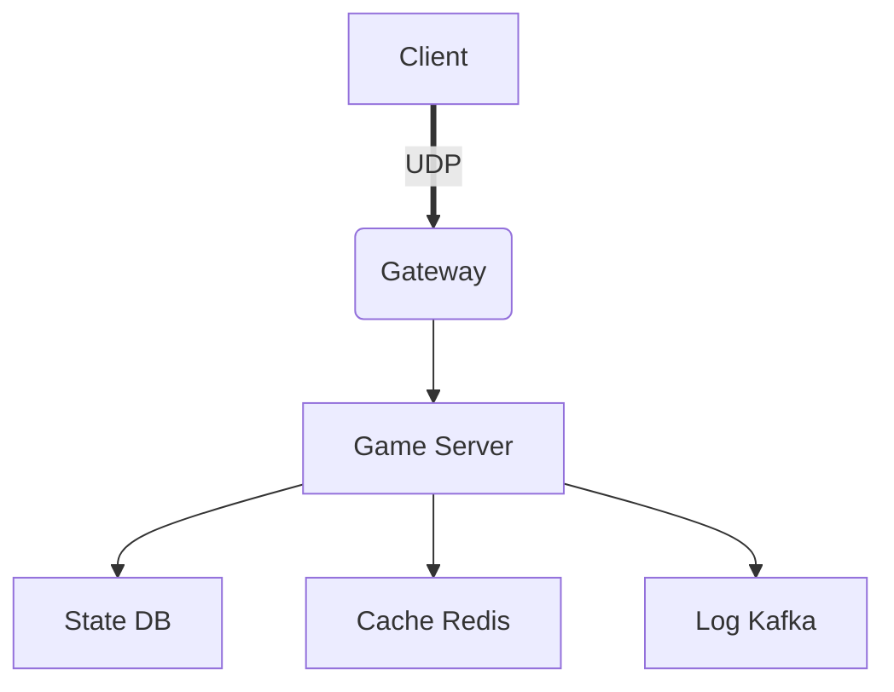

## 0 封面  
| 项目 | 内容 |
| ---- | ---- |
| 游戏名称 | 【】 |
| 文档编号 | 【】 |
| 版本 | 【】 |
| 作者 / 主程 | 【】 |
| 评审人 | 【】 |
| 最后更新 | 【】 |

---

## 1 版本记录  
| 日期 | 版本 | 修订人 | 变更摘要 |
| ---- | ---- | ------ | -------- |
|      |      |        |          |

---

## 2 目标与范围  
- **目标**：用 1-2 句话说明“本文档解决什么问题”。  
- **范围**：覆盖【客户端 / 服务器 / 工具链】，不包括【运营后台细节】。

---

## 3 总体架构蓝图  
### 3.1 架构原则  
1. 高内聚、低耦合，支持热插拔模块。  
2. 状态同步 → 帧同步 / ECS / 事件驱动（勾选）。  
3. 跨平台：Win / macOS / iOS / Android / Console。  
4. 上线 6 个月内支持 100 w DAU，单服 1 w 并发。  

### 3.2 顶层模块图  


---

## 4 客户端架构  
### 4.1 分层与目录规范  
```
Assets/
├─ Scripts/
│  ├─ Core/          # 无依赖纯算法
│  ├─ ECS/           # 实体组件系统
│  ├─ Network/       # 协议层
│  ├─ UI/            # MVVM
│  └─ ThirdParty/
├─ Art/
└─ StreamingAssets/
```

### 4.2 框架选型  
- 渲染：URP 14.x  
- 网络：自研 UDP + KCP + Protobuf  
- 热更：HybridCLR / Lua / ILRuntime（勾选）  
- 包体：首包 ≤800 MB，整包 ≤2 GB，资源粒度 ≤2 MB。

### 4.3 关键时序  
| 场景 | 时序图 |
| ---- | ------ |
| 登录 | 客户端→Gateway→Auth→Token→GameServer |
| 匹配 | 客户端→Match→Room→Relay→帧同步 |

---

## 5 服务器架构  
### 5.1 服类型与数量估算  
| 服类型 | 单服承载 | 机器规格 | 数量（100 w DAU） |
| ------ | -------- | -------- | ----------------- |
| Gateway | 2 w | 4 C8 G | 5 |
| Game | 1 w | 8 C16 G | 10 |
| DB | 5 w | 16 C32 G | 2 主 4 从 |

### 5.2 技术栈  
- 语言：C# .NET 8 / Go 1.22 / Rust（勾选）  
- RPC：gRPC + Protobuf / WebSocket + JSON  
- 存储：MySQL 8（状态）、Redis 7（缓存）、Mongo（日志）、Tcaplus（可选）  
- 部署：Docker + K8s + Helm；CI/CD：GitLab Runner。

### 5.3 分区与扩缩容策略  
- 逻辑区-物理区映射表  
- 水平分片键：uid % 1024  
- 弹性策略：HPA CPU>60% 或 内存>70%。

---

## 6 网络与协议  
### 6.1 协议分层  
| 层 | 技术 | 说明 |
| -- | ---- | ---- |
| 传输 | UDP + KCP | 可靠有序，平均 RTT ≤80 ms |
| 序列化 | Protobuf | 版本兼容：字段编号只增不改 |
| 加密 | AES-256-GCM | 会话密钥 ECDH 协商 |

### 6.2 消息编号规范  
- 0x1xxx 客户端→网关  
- 0x2xxx 网关→客户端  
- 0x3xxx 内部 RPC

### 6.3 流量与带宽估算  
- 帧同步：15 fps，每帧 300 Byte → 单用户 4.5 KB/s  
- 1 w 并发 → 45 MB/s 出站，峰值 ×1.5 = 67.5 MB/s。

---

## 7 数据与存储  
### 7.1 核心实体 ER 图  
（贴图或 PlantUML）

### 7.2 分库分表规则  
- 用户库：db_user_{00-31}  
- 日志库：按年月分区表  
- 索引：uid + 时间联合索引

### 7.3 缓存策略  
- Redis 分片 1024 slot，用户热数据 TTL 900 s  
- 缓存模式：Cache-Aside + 写穿透

---

## 8 运维与监控  
### 8.1 日志规范  
- 格式：JSON，必填字段 time/level/server_id/uid/event_id  
- 链路追踪：OpenTelemetry TraceId 透传  
- 采样：错误 100%，正常 1%

### 8.2 监控告警  
| 指标 | 阈值 | 告警渠道 |
| ---- | ---- | -------- |
| P99 延迟 | >200 ms | 飞书 + 电话 |
| 错误率 | >1% | 飞书 |
| 内存 | >85% | 飞书 |

### 8.3 灰度与回滚  
- 灰度比例：5%→20%→50%→100%  
- 回滚时间：≤5 min（Helm rollback）

---

## 9 安全与合规  
- 防沉迷：接入国家实名系统，token 有效期 30 min  
- 数据加密：静态 AES-256，传输 TLS1.3  
- 反外挂：服务器权威逻辑 + 行为检测 + 客户端完整性校验  
- GDPR：用户数据可导出 & 可删除，72 h 内响应。

---

## 10 性能与容量预估  
| 场景 | 目标 | 测试方法 |
| ---- | ---- | -------- |
| 帧率 | 60 FPS | Unity Profiler / Unreal Insights |
| 内存 | 峰值 ≤1.5 GB | Android Studio Memory |
| 启动 | 冷启动 ≤4 s | 真机 5 次平均 |
| 服务器延迟 | P99 ≤120 ms | 同省机房压测 |

---

## 11 风险与假设  
| 风险 | 概率 | 影响 | 缓解方案 | Owner |
| ---- | ---- | ---- | -------- | ----- |
| UDP 被运营商 QoS | 中 | 高 | 备选 WebSocket 通道 | 网络组 |
| Redis 单点故障 | 低 | 高 | 哨兵 + 集群 | 运维组 |

---

## 12 里程碑 & 责任矩阵  
| 里程碑 | 日期 | 交付物 | 负责人 |
| ------ | ---- | ------ | ------ |
| 架构评审 |      | 本文档 + 原型 | 主程   |
| First Playable | | 帧同步 10 v 10 压力报告 | 服务器组 |
| Soft Launch | | 1 w 并发压测报告 | 全部   |

---

## 13 附录  
- A. 术语表  
- B. 缩略语  
- C. 参考文档（开源地址、RFC、竞品分析链接）
