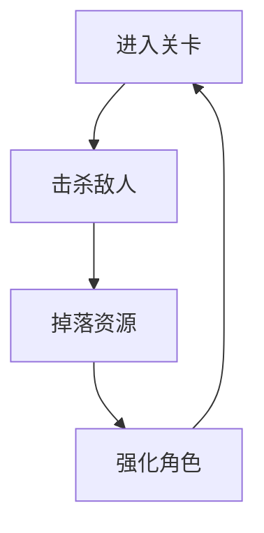

以下是一份可直接复制到 Confluence / 飞书 / Notion 的“中文游戏设计文档（GDD）”模板，采用 Markdown 格式，按“一级标题→二级标题→撰写要点”展开。你只需在每个 `【】` 内填空即可快速生成一份专业 GDD。

---

# 游戏设计文档（GDD）模板  
**游戏名**：【】  
**版本**：【】  
**更新日期**：【】

---

## 1 版本记录  
| 日期 | 版本 | 修订人 | 变更摘要 |
| ---- | ---- | ------ | -------- |
|      |      |        |          |

---

## 2 高阶信息  
| 项目 | 内容 |
| ---- | ---- |
| 一句话愿景 | 【30 字以内，核心情感】 |
| 品类 | 【ARPG / SLG / Party / Roguelike …】 |
| 目标平台 | 【iOS / Android / PC / Console】 |
| 核心受众 | 【年龄、性别、地域】 |
| 竞品对标 | 【1-3 款，一句话差异点】 |

---

## 3 核心玩法循环图  

（用 Mermaid 或贴图）

---

## 4 30 秒体验脚本  
| 时间轴 | 画面 & 操作 | 玩家感受 |
| ------ | ----------- | -------- |
| 0-5s   |             |          |
| 5-15s  |             |          |
| 15-30s |             |          |

---

## 5 系统概览表  
| 系统名 | 定位 | 入口等级 | 主要奖励 | 备注 |
| ------ | ---- | -------- | -------- | ---- |
| 战斗   | 核心 | 1        | 装备     |      |
| 商城   |  monetization | 5 | 钻石 |      |

---

## 6 单系统模板（复制 N 份）  
### 6.x 【系统名】  
1. **设计目的**  
   【一句话价值】
2. **入口 & 前置**  
   UI 路径：【主界面→XX 图标】  
   开放条件：【玩家等级≥5 & 通关 1-3】
3. **规则与流程**  
   - 主流程图（贴图或 Mermaid）  
   - 分支表（条件→结果）
4. **界面 & 交互**  
   Wireframe（贴图）+ 按钮说明
5. **数值 / 奖励**  
   | 档次 | 消耗 | 产出 | 概率 | CD |
   | ---- | ---- | ---- | ---- | -- |
   |      |      |      |      |    |
6. **异常处理**  
   - 网络中断：弹 Toast + 重试按钮  
   - 作弊校验：服务器二次验证
7. **验收标准**  
   - 打开界面 ≤1.2 s  
   - 支付成功率 ≥99%

---

## 7 关卡与内容清单  
### 7.1 世界地图  
（贴图或表格：章节→关卡→主题→预估时长）

### 7.2 单关卡模板  
| 字段 | 内容 |
| ---- | ---- |
| 关卡 ID |      |
| 主题    |      |
| 时长    |      |
| 敌人列表 |     |
| 掉落表  |      |
| 事件脚本 |      |

---

## 8 角色 & 敌人  
| ID | 名称 | 阵营 | 体型 | 关键技能 | 出现关卡 |
| -- | ---- | ---- | ---- | -------- | -------- |
|    |      |      |      |          |          |

---

## 9 故事与叙事  
- **世界观概述**：【≤200 字】  
- **主线大纲**：起→承→转→合（可附表）  
- **过场动画脚本**：镜头/时长/配音量

---

## 10 美术风格  
- **关键词**：【赛博 / 低多边形 / 国风手绘…】  
- **参考图链接**：【Pinterest 板】  
- **资源规格表**  
  | 类型 | 面数 | 贴图 | 骨骼 | 备注 |
  | ---- | ---- | ---- | ---- | ---- |
  | 主角 | 8 k  | 2×2k | 60   |      |

---

## 11 音频需求  
- **音乐风格**：【Synthwave，BPM 120】  
- **音效数量**：【UI 30 / 战斗 60 / 环境 20】 

---

## 12 技术约束  
- **引擎版本**：Godot 4.5
- **运行环境**：  
  - 最低：iPhone 8 / Android Snapdragon 660  
  - 目标：60 FPS，内存峰值 ≤1.5 GB  
- **网络**：【帧同步 UDP，平均延迟 ≤80 ms】  
- **包体大小**：【首包 ≤800 MB】

---

## 13 数据与埋点  
- **经济模型图**：产出-消耗-蓄水曲线  
- **关键事件表**  
  | 事件 ID | 触发时机 | 字段 | 采样率 |
  | ------- | -------- | ---- | ------ |
  |         |          |      |        |

---

## 15 风险 & 假设  
| 风险描述 | 概率 | 影响 | 缓解方案 | Owner |
| -------- | ---- | ---- | -------- | ----- |
|          |      |      |          |       |

---

## 16 附录  
- 术语表  
- 缩略语  
- 参考文档链接（原型、竞品分析）
